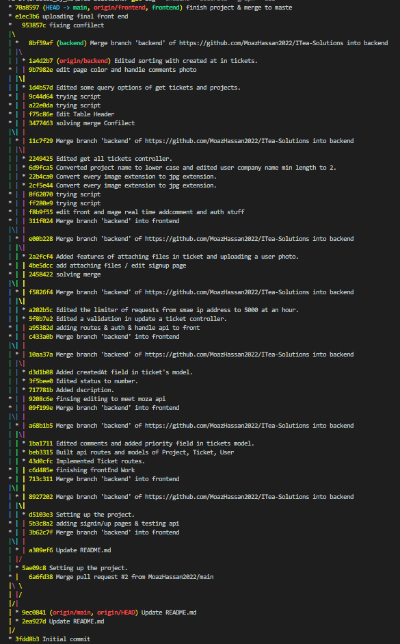

# CONNECT IT-Solutions

<h2>Table of Contents</h2>
<ul>
  <li><a href="#built-with--">Built With</a></li>
  <li><a href="#getting-started">Getting Started</a></li>
  <li><a href="#Description">Description</a></li>
  <li><a href="#Documentation">Documentation</a></li>
  <li><a href="#commit-history">Commit History</a></li>
  <li><a href="#Screenshots">Screenshots</a></li>
  <li><a href="#Contributors">Contributors</a></li>
</ul>

<h2 href="#BuiltWith">Built With : </h2>
 <ul>
  <li><a href="https://www.w3schools.com/nodejs/">Node js</a></li>
  <li><a href="https://www.javatpoint.com/expressjs-tutorial">Express js</a></li>
  <li><a href="https://www.w3schools.in/mongodb/tutorials/">MongoDB</a></li>
  <li><a href="http://www.w3schools.me/aspnetcore/implement-jwt">JSON Web Token</a></li>
  <li><a href="https://www.w3schools.com/REACT/DEFAULT.ASP">React js</a></li>
  <li><a href="https://redux.js.org/">Redux</a></li>
  <li><a href="https://mui.com/material-ui/getting-started/templates/">Material UI</a></li>
 </ul>

<h2 href="#GettingStarted">Getting Started</h2>
<blockquote>
  
This is a list of needed instructions to set up your project locally, to get a local copy up and running follow these instructions.
 

</blockquote>
<ol>
<li>
  <h4>Clone the repository.</h4>
 </li>
 <li>
  <h4>cd into backend folder and create a file named "config.env" and fill it with this fields with your information. <h4>    <blockquote> 
 NODE_ENV=dev  
PORT=[PORT YOU WANT]  
DATABASE=[CONNECTION STRING OF YOUR DATABASE]  
USER=[DATABASE USER NAME]  
DATABASE_PASSWORD=[YOUR DATABASE PASSWORD]  
JWT_SECRET=[YOUR JWT SECRET STRING]  
JWT_EXPIRES_IN=[DATE example: 1d "for one day"]  
JWT_COOKIE_EXPIRES_IN=[Date example: 1 "for one day"]  
 </blockquote>
 </li>
 <li>
  <h4>Follow this article to install node js and npm <a href="https://phoenixnap.com/kb/install-node-js-npm-on-windows">Install Node js and npm</a></h4>.
 </li>
 <li>
  <h4>cd backend && npm i && npm start</h4>
 </li>
 <li>
  <h4>cd .. && cd frontend && npm i && npm start</h4>
 </li>
 </ol>

<h2 href="#Description">Description</h2>
<blockquote>
  

  This website was implemented for an internship program at <a href="https://safecotech.com/">Safecotech Company</a>.
   
  It is a website for submitting and solving tickets in the IT industry.
   
  The client could be a company or a person and he is able to submit a ticket to be viewed by website admins and then answered, look on solved tickets before to see if he can find a problem similar to his one or manage his own currently being answered tickets.
   
  The admins can see pending tickets that are not assigned to any admin yet, manage their own current tickets that the admin is discussing with client about it or see the solved tickets to look for a problem that might be similar to the problem he is currently solving.
   
  Each user has information like name, email, company name, password and maybe a photo. He can update his photo at any time, sign up new account, log in, log out and delete his account.
    
  Each ticket could has attachments (supporting any file type), title, description, comments, category(Network, Service, System and Telecommunications), priority(Ordinary, Important and Critical), project, created at date, client and admin if he assigned himself to the ticket.
    
  If any admin wants to answer a ticket, he can assign it to him and discuss with the client and send him answers.
   
  If the client finds that his problem is solved, he can close it and the problem will be moved to the solved tickets and has its answer.
   
  This website is developed in React js for the frontend and in Node js for the backend using MongoDB for the database.

 

</blockquote>

<h2 href="#Documentation">Documentation</h2>
<blockquote>
  

  You can see a documentation video for the website at Youtube <a href="https://www.youtube.com/watch?v=G2PCJBHN9Ik">Video Documentation</a>
  

</blockquote>
<blockquote>
  

  You can look on the API documentation at <a href="https://documenter.getpostman.com/view/22736405/VVkFatrB">API Documentation</a>
  

</blockquote>
<blockquote>
  

  You can look on the documentation as a pdf file at <a href="https://drive.google.com/file/d/1e03AvYyPktNC_d5mElBinzBgyIrMj5SQ/view?usp=sharing">PDF Documentaion</a>
  

</blockquote>

<h2 href="#CommitHistory">Commit History</h2>

<h2 href="#Screenshots">Screenshots</h2>
<ol>
<li>
  <h4>Log In with email and password.</h4>
  
</li>
<li>
  <h4>Sign Up with name, email, company name(optional), password and Upload a user photo(optional).</h4>
  
</li>
<li>
  <h4>Empty "manage your tickets" after Sign Up.</h4>
  
</li>
<li>
  <h4>Submit a new ticket, Category could be "Service", "System", "Network", and "Telecommunications". Attachments could be files of any type.</h4>
  
</li>
<li>
  <h4>Another client at manage your tickets.</h4>
  
</li>
<li>
  <h4>A client can "Update image", "Log out" or "Delete account"</h4>
  
</li>
<li>
  <h4>Logged in with an admin account, opened "pending tickets", and opened a ticket with attachments.</h4>
  
</li>
<li>
  <h4>Opened another pending ticket(If any attachment extension is not for an image like ".pdf" the user can click on it to open a new tab and see or download the attachment).</h4>
  
</li>
<li>
  <h4>Admin assigned the ticket to him by clicking on the fingerprint icon.</h4>
  
</li>
<li>
  <h4>Ticket is moved to "manage your tickets" for the admin and status became "being solved".</h4>
  
</li>
<li>
  <h4>An admin trying to solve another ticket with title: "Database is down" and added comments.</h4>
  
</li>
<li>
  <h4>Client(Owner of "Database is down" ticket) added a comment.</h4>
  
</li>
<li>
  <h4>The admin reached out to an answer and added it.</h4>
  
</li>
<li>
  <h4>Client is satisfied with this answer and clicked on Close Ticket Icon(if he is not satisfied he can continue discussing with the admin to make the admin submit other answers).</h4>
  
</li>
<li>
  <h4>Ticket status became solved, final answer is shown, and the ticket will be moved to "solved tickets" to be seen by other users.</h4>
  
</li>
<li>
  <h4>Another client is looking on "solved tickets" and the recently solved ticket is there with the answer.</h4>
  
</li>
<li>
  <h4>Filter Tickets(Filters could be applied at any where: "manage your tickets", "solved tickets" and "pending tickets").</h4>
  
</li>
<li>
  <h4>Sort tickets on priority, status, and/or Created at date.</h4>
  
</li>
<li>
  <h4>Choose the project, category and/or title to search with.</h4>
  
</li>
<li>
  <h4>Applying sorting tickets on "Created at" date to be from old to new.</h4>
  
</li>
<li>
  <h4>All pending tickets after applying the "Created at" date filter.</h4>
  
</li>
<li>
  <h4>Update a user photo.</h4>
  
</li>
<li>
  <h4>User's photo is updated.</h4>
  
</li>
</ol>

<h2 href="#Contributors">Contributors</h2>
<h3>Frontend</h3>
<table> 
  <tbody>
    <tr>
      <td align="center">
        
         
        <a href="https://github.com/Waer1">Yousef Khaled</a>
      </td>
    </tr>
  </tbody>
</table>
<h3>Backend</h3>
<table> 
  <tbody>
    <tr>
      <td align="center">
        
         
        <a href="https://github.com/MoazHassan2022">Moaz Mohammed</a>
      </td>
    </tr>
  </tbody>
</table>
